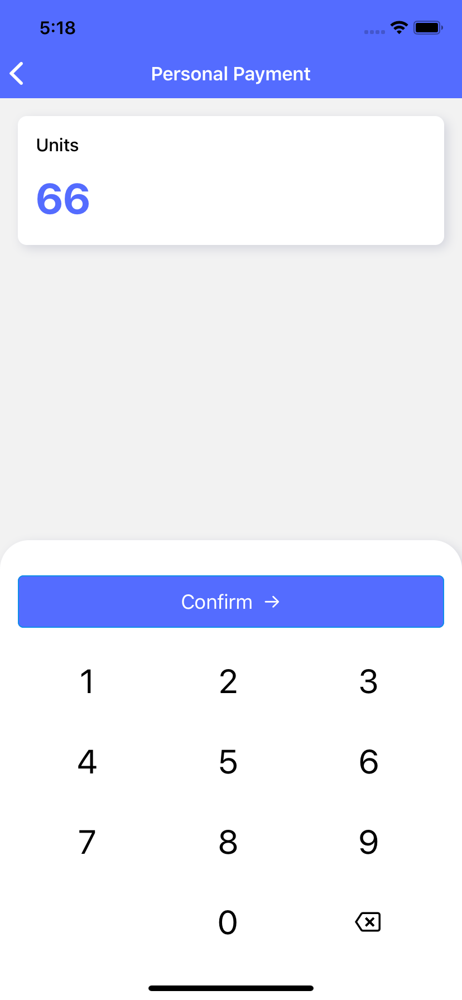

# 📱 React Native Numeric Pad 📱

A React Native component for amount or verification code input. It easily handles both decimals and integers, and runs smoothly for both IOS and Android. The design is simple and clear with numbers, dot, and one custom button.

## 💃 Demo
Decimal Input            										|  Integer Input
:--------------------------------------------------------------:|:--------------------------------------------------------------:
  |  

📗 Note
1. This keyboard has basic input validation such as number of point and the point's position.
2. This package only contains the number pad(second half screen). You need to bind the value and a handler function with your onw component(see my example).
3. The value output form this keyboard is a string type. Don't forget to convert to achieve your goal🤙

## 🚀 Getting Started

**via NPM**

```
npm i react-native-numeric-pad

📗 Note
This component has a peer dependency: "react-native": "^0.63.4", to smoothly match your 
project you may ues:

npm i react-native-numeric-pad --legacy-peer-deps
```

**via Yarn**

```
yarn add react-native-numeric-pad
```
  
## 🛻 Usage

  
```
import  NumericPad  from  'react-native-numeric-pad'

...

<NumericPad
  numLength={8}
  onValueChange={(v) => { setState(v)} }
  allowDecimal={true}
}/>
```


## 👉🏼 Props

| Prop                          | Type              | Default                                                                                                |  Required  |
| ----------------------------- | ----------------- | ------------------------------------------------------------------------------------------------------ | ---------- |
|numLength                      |number             |-                                                                                                       | **Yes**    |
|onValueChange                  |func               |-                                                                                                       | No         |
|activeOpacity                  |number             |`0.9`                                                                                                   | No         |
|buttonSize                     |number             |`60`                                                                                                    | No         |
|allowDecimal                   |boolean            |`true`                                                                                                  | No         |
|style                          |ViewStyle          |-                                                                                                       | No         |
|buttonAreaStyle                |ViewStyle          |-                                                                                                       | No         |
|buttonItemStyle                |ViewStyle          |-                                                                                                       | No         |
|buttonTextStyle                |TextStyle          |` { color: '#000', fontSize: 30, fontWeight: '400' }`                                                   | No         |
|numericDisabled                |boolean            |`false`                                                                                                 | No         |
|accessible                     |boolean            |`false`                                                                                                 | No         |
|buttonTextByKey                |object             |`{one: "1",two: "2",three: "3",four: "4",five: "5",six: "6",seven: "7",eight: "8",nine: "9",dot: '.',zero: "0",}`| No|
|rightBottomButton              |React.Component    |`null`                                                                                                  | No         |
|onRightBottomButtonPress       |func               |-                                                                                                       | No         |
|rightBottomButtonDisabled      |boolean            |`false`                                                                                                 | No         |
|rightBottomButtonSize          |number             |`60`                                                                                                    | No         |
|rightBottomAccessibilityLabel  |string             |`"right_bottom"`                                                                                          | No         |
|rightBottomButtonItemStyle     |ViewStyle          |-                                                                                                       | No         |


  

## 👉🏼 Ref Actions

`const numpadRef = useRef(null)`

  

| Prop | Description |
| -----------------------------     | -----------------------------------------------------------|
|numpadRef.current.clearAll()       |This method completely clears the entered code.             |
|numpadRef.current.clear() 		      |This method only delete last number of entered code.        |
|numpadRef.current.setValue(val) 		|This method sets the numpad's input to the specified value  |

  

## 🍗 My Example
```javascript

import  React, { useState, useRef } from  'react'
import { StyleSheet, Text, View, TextInput } from  'react-native'
import { Button } from  '@ant-design/react-native'
import { Ionicons } from  '@expo/vector-icons'
import  NumericPad  from  'react-native-numeric-pad'
import { I18n } from  '../../i18n'
import { LAYOUT, COLORS } from  '../../theme'
import { deviceHeight, deviceWidth } from  '../../theme/devices'

export  default  function  Widget ({ navigation, route }) {
const [amount, setAmount] = useState('')
const numpadRef = useRef(null)

return (
  <View style={styles.container}>
    <View style={styles.shadowBox}>
      <Text>{I18n.translate('amount')} $</Text>
      <TextInput
        style={styles.amountTxt}
        showSoftInputOnFocus={false}
        maxLength={8}
        autoFocus={true}
        editable={false}
        selectTextOnFocus={false}
        value={amount}
        />
    </View>

    <View style={styles.keyboardContainer}>
      <Button style={styles.btn}  type='primary'
        onPress={() => {}}
        disabled={!amount}>
        {I18n.translate('confirm') + ' →'}
      </Button>

      <NumericPad
        ref={numpadRef}
        numLength={8}
        buttonSize={60}
        activeOpacity={0.1}
        onValueChange={value => setAmount(value)}
        allowDecimal={true}
        // Try them to understand each area :)
        // style={{ backgroundColor: 'black', paddingVertical: 12 }}
        // buttonAreaStyle={{ backgroundColor: 'gray' }}
        // buttonItemStyle={{ backgroundColor: 'red' }}
        rightBottomButton={<Ionicons name={'ios-backspace-outline'} size={28} color={'#000'}/>}
        onRightBottomButtonPress={() => {numpadRef.current.clear()}
        }
      />
    </View>
  </View>
  )
}


const styles = StyleSheet.create({
  container: {
    flex: 1,
    padding: LAYOUT['spacing-05']
  },
  shadowBox: {
    width: '100%',
    borderRadius: LAYOUT['spacing-03'],
    padding: LAYOUT['spacing-05'],
    backgroundColor: COLORS.WHITE,
    shadowOffset: {
      height: 3,
      width: 3
    },
    shadowOpacity: 0.15,
    shadowRadius: 5,
    shadowColor: '#1D2660',
    elevation: 5
  },
  amountTxt: {
    fontSize: 38,
    fontWeight: '700',
    lineHeight: 40,
    marginTop: LAYOUT['spacing-06'],
    color: COLORS['brand-01']
  },
  keyboardContainer: {
    width: deviceWidth,
    height: deviceHeight * 0.46,
    borderRadius: 26,
    justifyContent: 'center',
    alignItems: 'center',
    paddingHorizontal: 16,
    position: 'absolute',
    bottom: 0,
    backgroundColor: COLORS.WHITE,
    shadowOffset: {
      height: 3,
      width: 3
    },
    shadowOpacity: 0.15,
    shadowRadius: 5,
    shadowColor: '#1D2660',
    elevation: 5
  },
  btn: {
    width: '100%',
    marginTop: 10,
    backgroundColor: COLORS['brand-01']
  }
})
```

  

## 📰 License


This project is licensed under the MIT License - see the [LICENSE.md](LICENSE.md) file for details